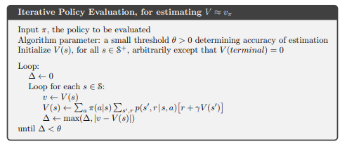
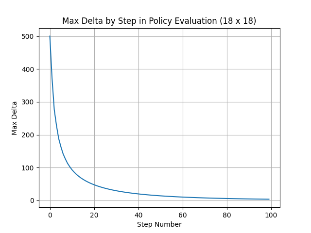

# Policy Evaluation in Grid World

This project implements **Iterative Policy Evaluation** in a Grid World environment, based on techniques from *Reinforcement Learning: An Introduction* by Barto and Sutton (Chapter 4). Using an equiprobable random policy, the agent evaluates states iteratively. The value function approximation for each state is computed over a fixed number of steps, with the **max delta** (`|v - v'|`) plotted at each step to visualize convergence.

  


After learning is complete, the policy is adjusted based on the computed value function and tested in the `gymnasium` environment.


## Installation

1. Clone the repository and navigate to the project directory.  
2. Install dependencies:

   ```bash
   pip install -r requirements.txt
   ```

## Usage

Run the main script with default settings:

```bash
python3 main.py
```

This will execute the policy evaluation on a large grid. Resulting visualizations for the value function and policy execution will be generated.

  


### Example with a Smaller Map

To run the policy evaluation on a smaller grid, use the `--map` option:

```bash
python3 main.py --map='small'
```

  


### Extended CLI Options

Customize the evaluation with additional command-line options:

```bash
python3 main.py --map='small' --video_folder='./videos' --steps=1000 --episodes=1
```

- `--map`: Choose from available map sizes (`small`, `large`).  
- `--video_folder`: Specify a folder to save video recordings of the policy execution.  
- `--steps`: Set the number of steps for iterative policy evaluation.  
- `--episodes`: Define the number of episodes to run.

## License

This project is licensed under the MIT License.


